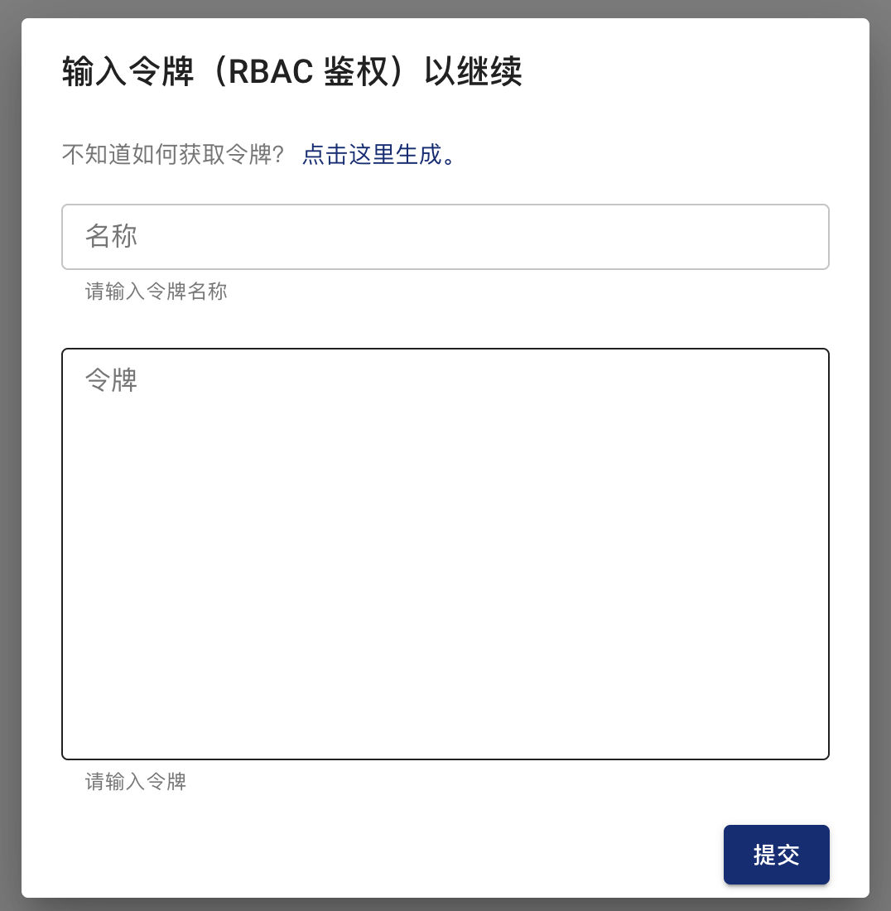

This document describes how to manage user permissions in Chaos Mesh, including creating and binding permissions, managing tokens and on/off permissions for authentication.

Chaos Mesh uses the native [RBAC](https://kubernetes.io/zh/docs/reference/access-authn-authz/rbac/) features to manage user roles and permissions.In creating, viewing and managing chaos experiments, users need to have `chaos-mesh.org` this `apiGroups` the corresponding permissions for the Chaos experiment custom resource.

::note Note

Enable authentication by default when using Helm to install Chaos Mesh.For production environments and other scenarios with high safety requirements, it is recommended that permission validation be maintained.If you just want to experience the Chaos Mossh feature, want to quickly create chaos by closing permissions and quickly creating a chaos experiment, you can see[permission validation on and off](#开启或关闭权限验证功能)section about how to close permission validation.

:::

### Create user and bind permissions

You can create users and bind permissions directly through the Chaos Mesh Dashboard interface.When accessing Dashboard there will be a login popup, click**"Click here to generate"**：



When tapped, the popup window is shown below：


The actions below need to be performed on the popup window to step 3：

1. Select permissions

   To get appropriate permissions for the entire Kubernetes mixing experiment, check the**cluster range**box.If namespace is specified in the**namespace**dropdown option, only permissions are given under that namespace.

2. Select Role

   The following roles are currently provided by Chaos Mesh：

   - Manager：has all permissions to create, view, update, delete, etc. Chaos experiment.
   - Viewer：has only the view permissions for the Chaos experiment.

3. Generate RAC configuration

   After determining the scope and role of the created permission, the Dashboard page shows the corresponding RAC configuration.For example, `busybox` RBAC configuration for manager roles under name is shown below：

   ```yaml
     kind: ServiceAccount
     apiVersion: v1
     metada:
       namespace: busybox
       name: account-busybox-manager-zcbaf

     ----
     kind: Role
     apiVersion: rbac. uthorization.k8s. o/v1
     metadata:
       name: busybox
       name: role-busybox-manager-zcbaf
     rules:
     - apiGroups: [""]
       resources: ["pods", "namespaces"]
       verbs: ["get", "watch", "list"]
     - apiGroups:
       - chaos-mesh. rg
       resources: [ "*" ]
       verbs: ["get", "list", "watch", "create", "delete", "patch", "update"]

     ----
     apiVersion: rbac. uthorization.k8s. o/v1
     kind: RoleBinding
     metada:
       name: bind-busybox-manager-zcbaf
       name: busybox
     subjects:
     - kind: ServiceAccount
       name: account-busybox-manager-zcbaf
       namespace: busybox
     roleRef:
       kind: Role
       name: role-busybox-manager-zcbaf
       apiGroup: rbac. uthorization.k8s.io
   ```

   Press the Dashboard window to copy**from the top right corner of the RBAC configuration**to copy the RABAC configuration to the clipboard and write to the local file `rbac.yaml`.

4. Create user and bind permissions

   Run the following command in the terminal：

   ```bash
   kubtl apply -f rbac.yaml
   ```

5. Generate Token

   复制 Dashboard 中第 3 步“最后获取令牌”下的命令，并在终端中运行：

   ```bash
   kubtl descripbe - n busybox secrets account-busybox-manager-zcbaf
   ```

   Output shown below：

   ```log
   Name: account-busybox-manager-zcbaf-token-x572r
   Namespace: busybox
   Labels:       <none>
   Annotations: kubernetes. o/service-account.name: account-busybox-manager-zcbaf
                 kubernetes. o/service-account.uid: 19757b8d-195f-4231-b193-be18280b65d3

   Type: kubernetes.io/service-account-token

   Data
   ======
   ca. rt: 1025 bytes
   namespace: 7 bytes
   token: eyJhbGciOi. .z-PWMK8iQ
   ```

   Copy token data from the above output for next login.

6. Sign in to Chaos Mesh with created users

   Tap**on Dashboard Token Auxiliary window to close**and return to login window.Enter tokens copied above in the**token**input and enter a meaningful name for the token in the**name**input, recommend the range and role of permission, e.g. `busybox-manager`.Once the input is complete, click**to submit**to login:

   

::note Note

- There is a need to ensure that local users who execute kubectl have cluster permissions to create users, bind different permissions, and get token.

- If Chaos Mesh Dashboard is not deployed, you can generate your own RABAC configuration, create users and bind permissions via kubectl.

:::

### Manage Tokens

如要管理令牌，在 Dashboard Web 页面中点击**设置**，如下所示：


New tokens can be added to**to add token**windows. You can also click**to use**to switch between tokens with different permissions, or delete tokens.

### Enable or disable permission authentication function

Enable authentication by default when using Helm to install Chaos Mesh.For production environments and other scenarios with high safety requirements, it is recommended that permission validation be maintained.If you just want to experience the Chaos Mossh feature, want to quickly create a chaos experiment by closing permission checks, you can set `--set dashboard.securityMode=false`, command shown below：

```bash
helm upgrade chaos-mesh chaos-mesh/chaos-mesh --namespace=chaos-testing --set dashboard.securityMode=false
```

If you want to restart permission validation, then reset `--set dashboard.securityMode=true`.
